# CineFlow - Cinema Ticket Booking App

A Flutter-based cinema ticket booking application developed by **Najam Lodhi**.

[](https://flutter.dev/)

CineFlow is an app built with the **Flutter** framework to provide a seamless online ticket booking experience.

## Demo
<div align="center">
  <video src="https://user-images.githubusercontent.com/62943972/149531248-ccbd3b54-1ae8-4565-807b-2f8bf2e64d21.mp4"/>
</div>

## Backend
Uses a REST API built with NodeJS and MySQL. You need to deploy the backend yourself and pass the URL at build time:

```dart
flutter run --dart-define=BASE_URL="your-url-here"
```

## :sparkles: App Features

- Authentication.
- Browsing movies.
- Viewing movie details.
- Watching movie trailers.
- Checking available movie shows.
- Theater seat map for ticket selection.
- Online ticket booking.
- Online booking payment.
- Viewing ticket bookings history.

## :wrench: Technical Features

<table>
    <tr>
        <td><a href="https://pub.dev/packages/riverpod">Riverpod</a> State Management - v1.0.3</td>
        <td><a href="https://pub.dev/packages/dio">Dio</a> + Interceptors For JWT Refresh</td>
    </tr>
    <tr>
        <td><a href="https://pub.dev/packages/freezed">Freezed</a> + <a href="https://pub.dev/packages/flutter_hooks">Flutter Hooks</a> For JSON Handling</td>
        <td>Custom Wrapper For <a href="https://pub.dev/packages/shared_preferences">Shared Prefs</a> + <a href="https://pub.dev/packages/flutter_secure_storage">Flutter Secure Storage</a></td>
    </tr>
    <tr>
        <td>MVC-S Clean Architecture</td>
        <td>Session persistence and encrypted key storage</td>
    </tr>
    <tr>
        <td>Reusable services architecture and code</td>
        <td>Custom reusable widgets</td>
    </tr>
    <tr>
        <td>Unit tested code + Automated Code Coverage</td>
        <td>Dart ENV variables</td>
    </tr>
    <tr>
        <td>Full documentation</td>
        <td>Complex CI/CD Build, Test and Deploy pipelines</td>
    </tr>
    <tr>
        <td>Github Branch Protection + Secrets</td>
        <td>Linting + Custom Analyzer Rules</td>
    </tr>
</table>

## :iphone: Screens

Splash Screen | Home Screen | Welcome Screen |
:------------:|:-----------:|:--------------:|
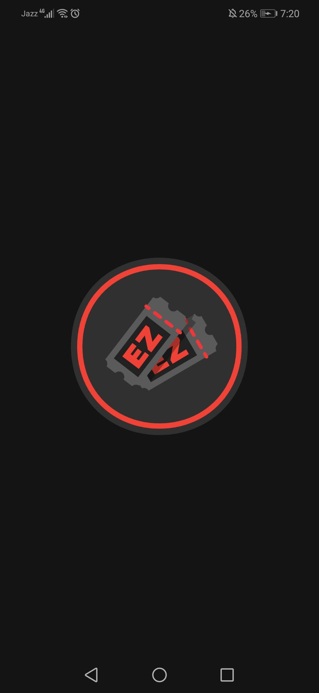 | 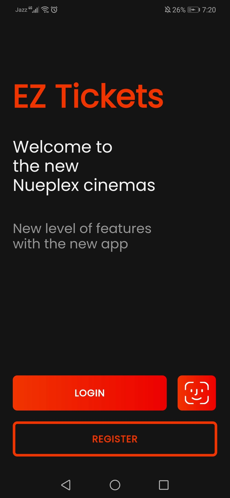 | 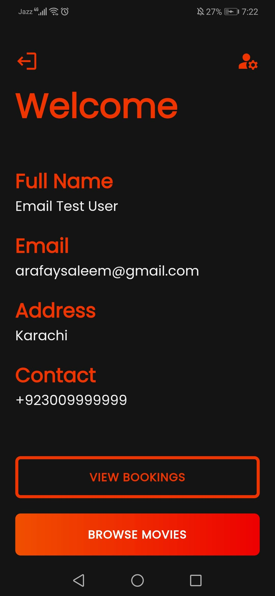
Movie Details Screen | Movies Screen | Movie Trailer Screen |
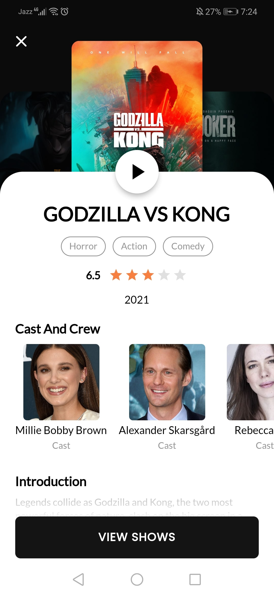 | 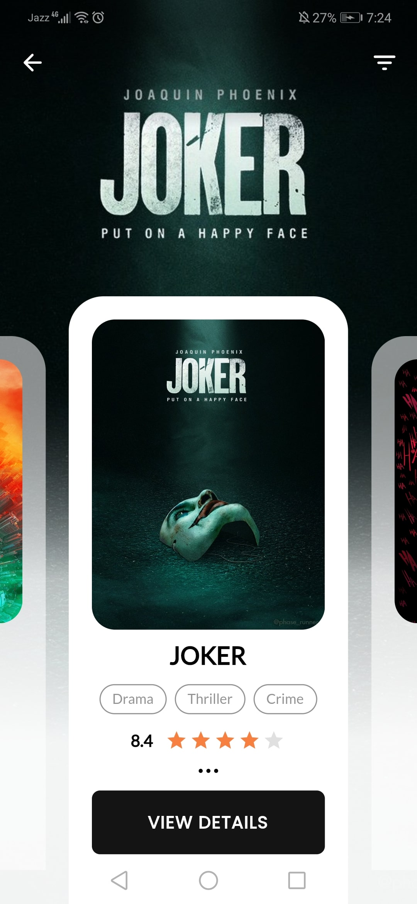 | 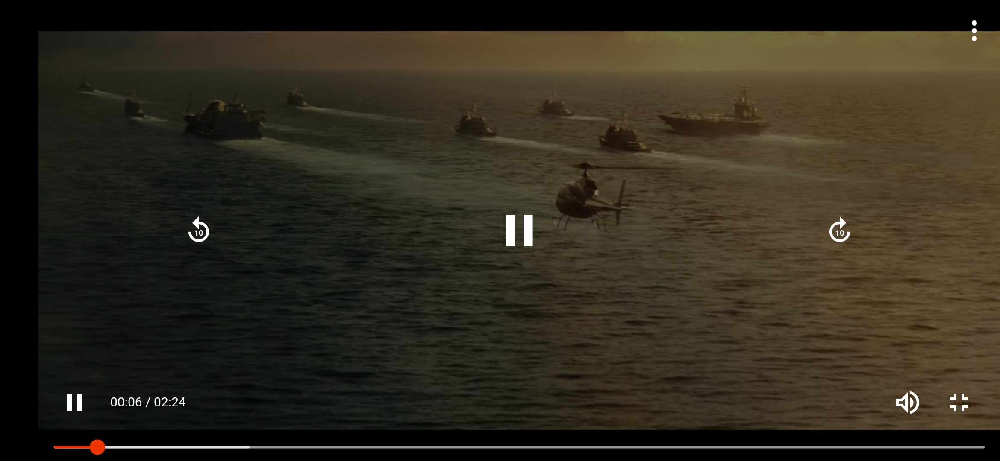
Shows Screen | Theater Screen | Tickets Screen |
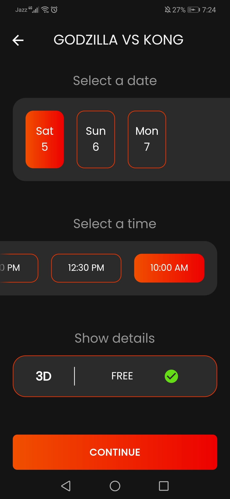 | 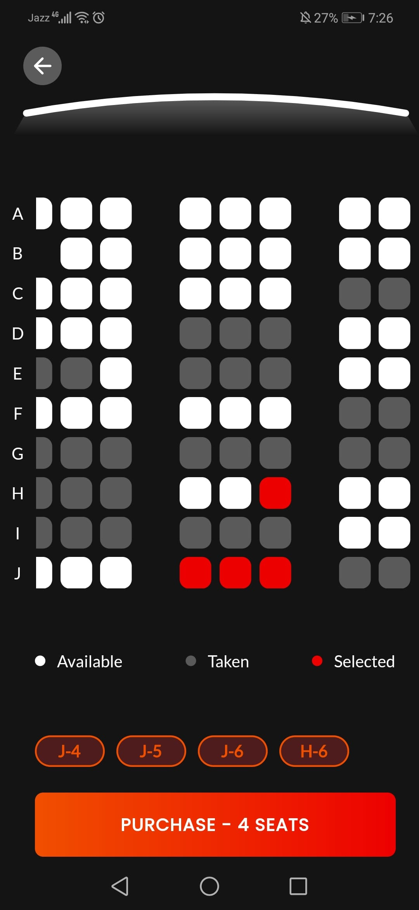 | 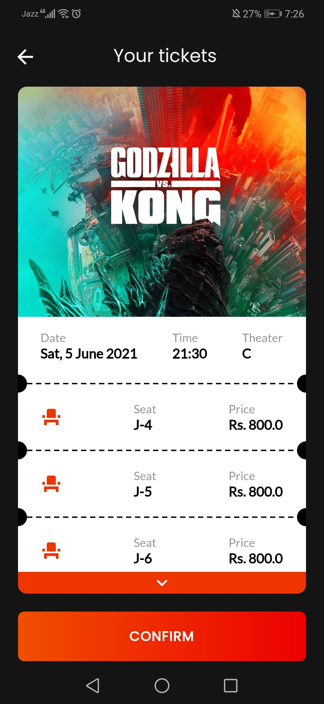
Payment Screen | Confirmation Screen | Bookings History Screen |
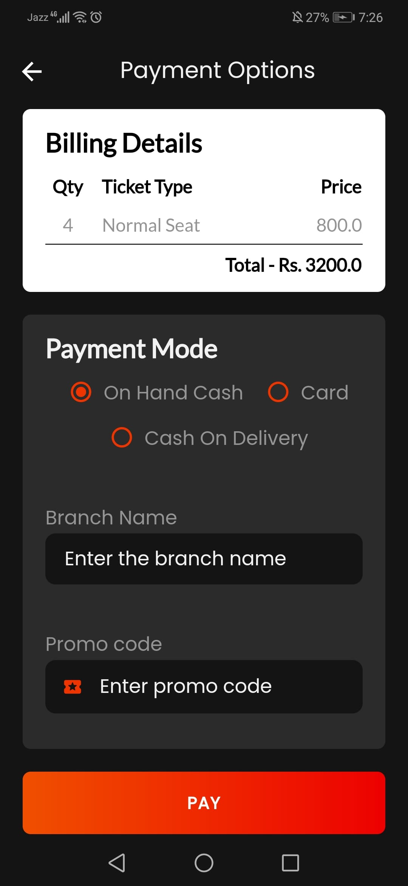 |  | 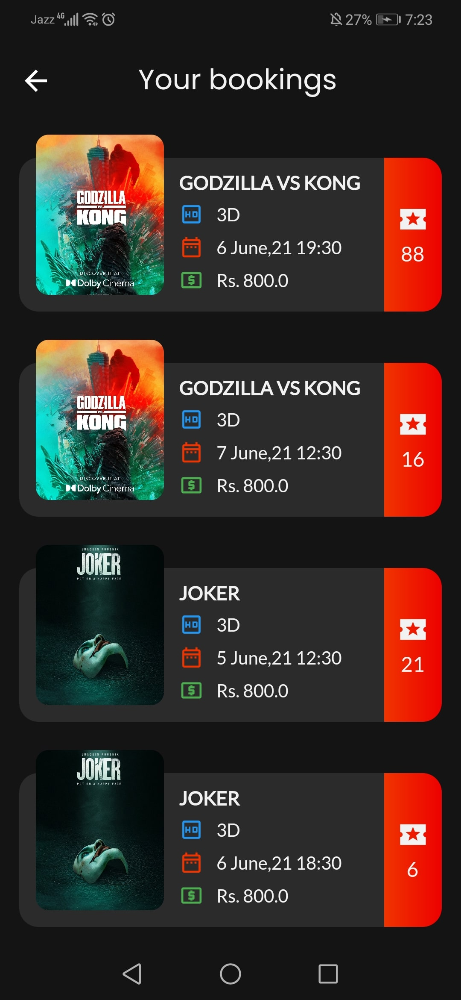
Login Screen | Register Screen | Change Password Screen |
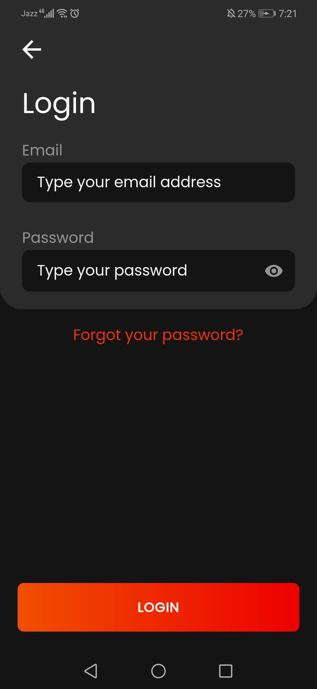 | 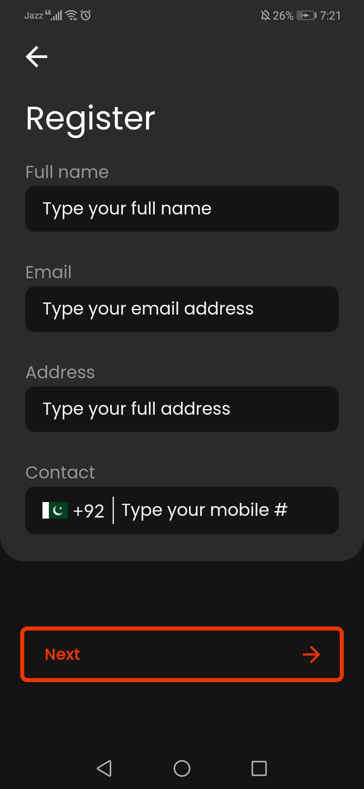 | 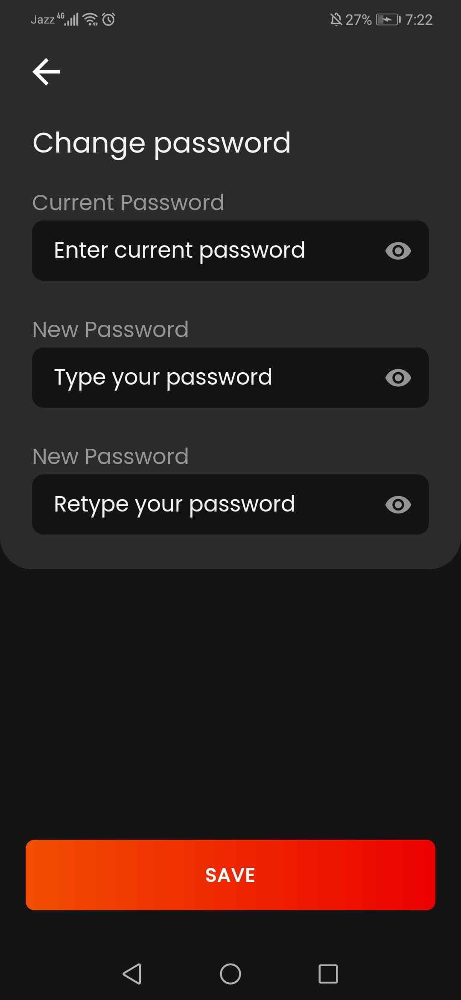
Forgot Password Screen | OTP Screen | OTP Email |
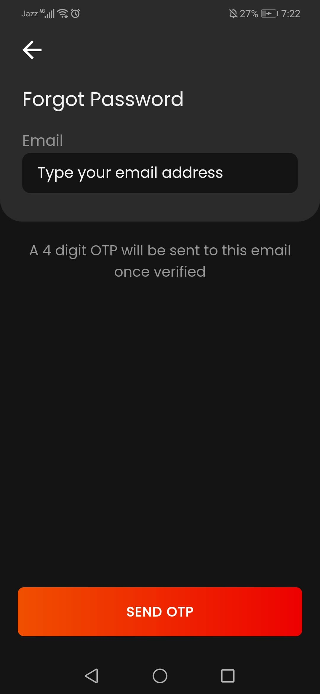 | 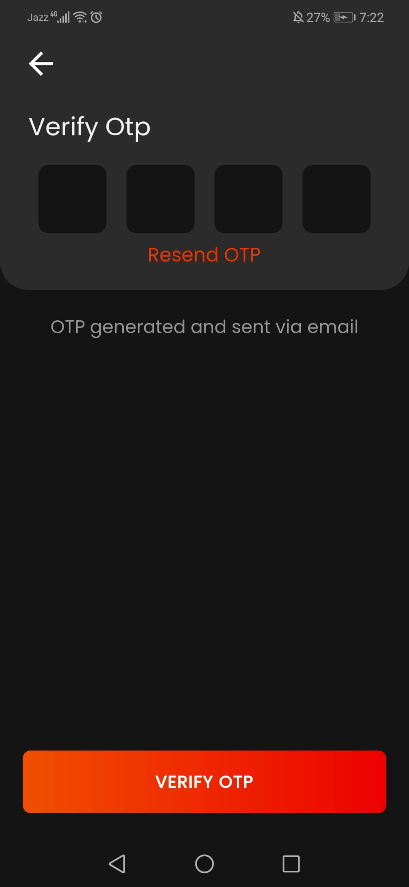 | 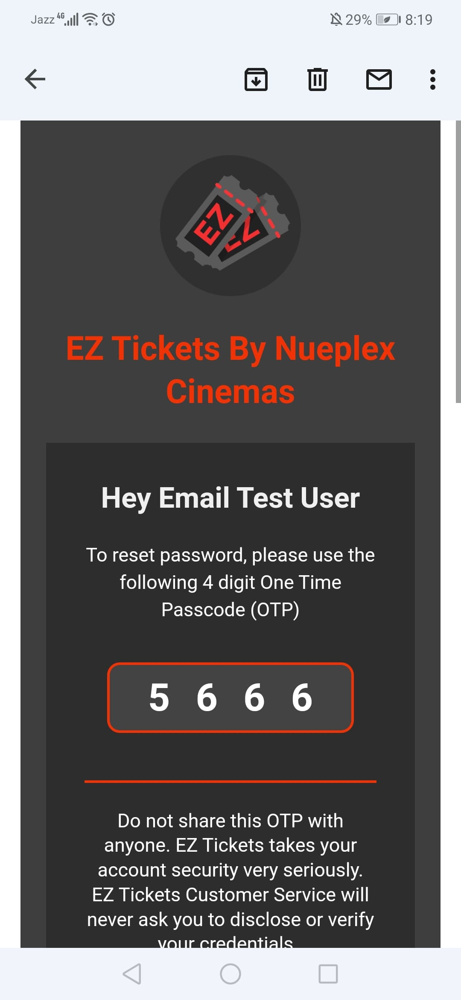

## ⭐ Future Features

- Facial Authentication.
- Cancelling Bookings.
- Movie Reviews.
- FAQ page.

## 🚀 Technologies

- Flutter v2.8.1
- Dart v2.14.4

## 👨‍💻 Developer

**Najam Lodhi**
- GitHub: [NajamL96](https://github.com/NajamL96)

## 📝 License

Copyright (c) 2024 Najam Lodhi. All rights reserved.
